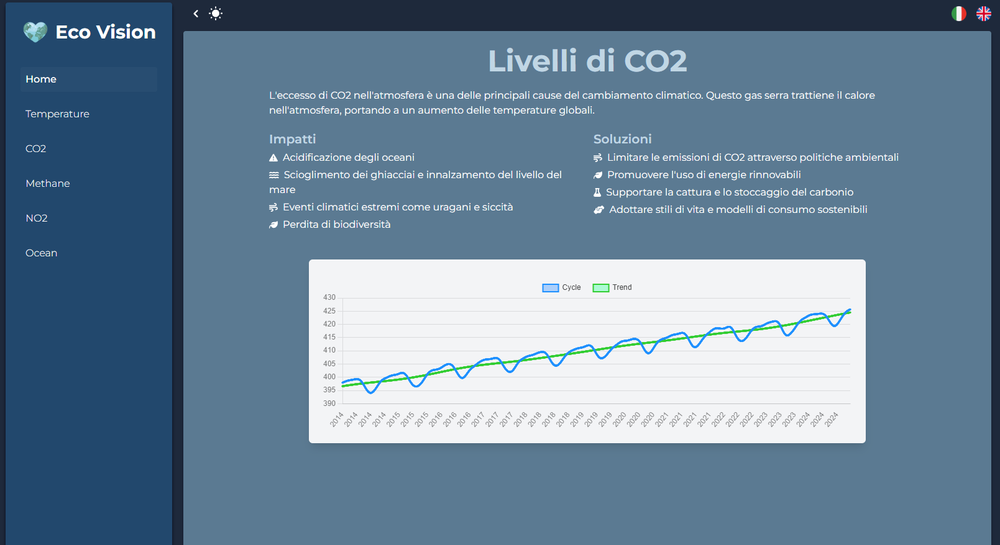
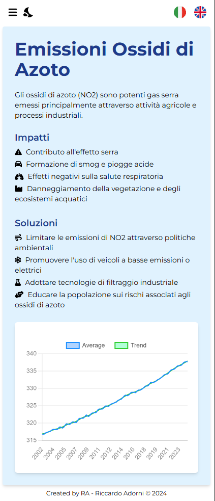

<h1 align="left">🚀 S2I • Project • Front End Development</h1>
<!-- <h3 align="left">Hello 👋, I'm Rick !  -->
 I'm exited to present my personal project for the Front End Development course.</h3>

For this project, I created multi-page dashboards  responsive  to display data on global warming.</h3>
<h3 align="center">https://eco-vision.netlify.app/</h3>

# Home

The main page of the site features as a introductory section and a sidebar that allows users to select topics of interest and lenguage from italian to english and the dark and light mode.

  
  
  

# Example page

Each entry in the sidebar corresponds to a specific content, which includes a brief description of the topic, two lists pertaining to impacts, solutions and a chart for data visualization.

  

### Languages

• HTML 
• CSS 
• [tailwindcss](https://tailwindcss.com) 
• [Chart.js](https://www.chartjs.org) 
• [Axios](https://axios-http.com) 
• [Font Awesome](https://fontawesome.com) 
• [React](https://react.dev) 

<!-- ### Bundler

[Vite](https://vitejs.dev)

### Webhost

[Netlify](https://www.netlify.com) -->
